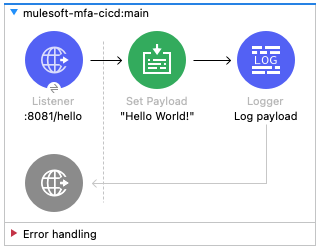

# MuleSoft MFA CI/CD example

Repository used to demonstrate how to create a simple CI/CD pipeline using a connected app in Anypoint Platform (for MFA).

Tutorial link: TBD

Similar resources:
- [GitHub repo] [alexandramartinez/github-actions](https://github.com/alexandramartinez/github-actions)
- [Blog post + video] [Part 1: How to set up a CI/CD pipeline to deploy your MuleSoft apps to CloudHub using GitHub Actions](https://www.prostdev.com/post/how-to-set-up-a-ci-cd-pipeline-to-deploy-your-mulesoft-apps-to-cloudhub-using-github-actions)
- [Blog post + video] [Part 2: CI/CD pipeline with MuleSoft and GitHub Actions - secured/encrypted properties](https://www.prostdev.com/post/part-2-ci-cd-pipeline-with-mulesoft-and-github-actions-secured-encrypted-properties)
- [Blog post + video] [Part 3: CI/CD pipeline with MuleSoft and GitHub Actions - MUnit testing](https://www.prostdev.com/post/part-3-ci-cd-pipeline-with-mulesoft-and-github-actions-munit-testing)
- [Blog post + video] [Part 4: CI/CD pipeline with MuleSoft and GitHub Actions - MUnit minimum coverage percentage](https://www.prostdev.com/post/part-4-ci-cd-pipeline-with-mulesoft-and-github-actions-munit-minimum-coverage-percentage)
- [Blog post + video] [Part 5: CI/CD pipeline with MuleSoft and GitHub Actions - Enabling MFA through a Connected App](https://www.prostdev.com/post/part-5-ci-cd-pipeline-with-mulesoft-and-github-actions-enabling-mfa-through-a-connected-app)

## Flow

This is a simple flow that returns a `"Hello World!"` message. You can call this HTTP listener using port `8081` and path `/hello`.



If you run this Mule application locally, you can run: 

```
curl localhost:8081/hello
``` 

from your terminal and you'll receive the following response:

```
Hello World!
```
